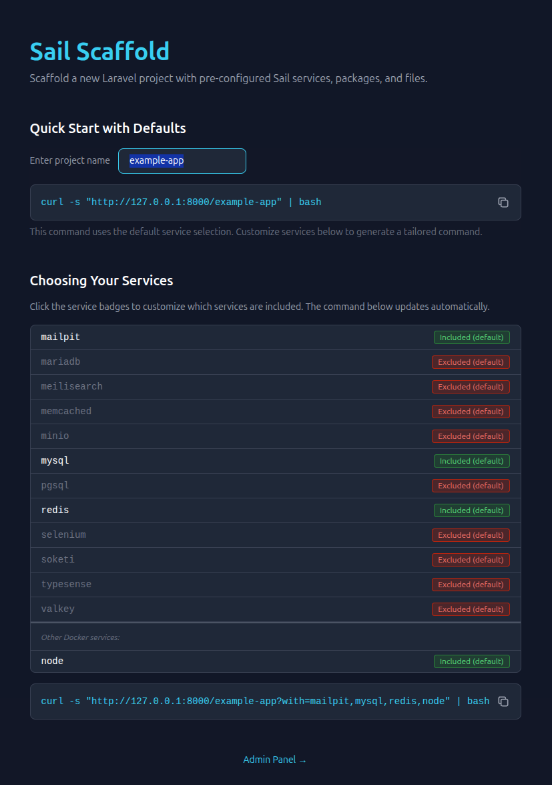
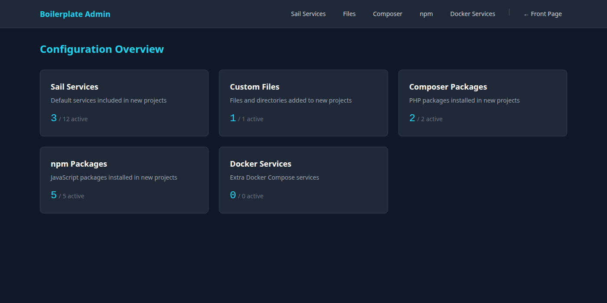

# Sail Scaffold

A self-hosted Laravel project scaffolding service that generates ready-to-run projects with pre-configured Sail services, Composer/npm packages, custom files, and Docker services.



## How It Works

The application serves a bash install script via HTTP. Developers run a single `curl` command to scaffold a full Laravel project with Docker (Sail) out of the box.

```bash
curl -s "http://localhost/my-app" | bash
```

Replace `my-app` with your desired project name.

The generated script runs through four phases:

1. **Scaffold** — Creates a Laravel project, installs Sail with selected services, and installs Composer/npm packages in a single Docker run (output streams live; package failures become warnings, not fatal errors)
2. **Docker Services** — Appends custom services to `compose.yml`
3. **Pull** — Downloads Sail container images for selected services (with retries)
4. **Build** — Builds the Docker environment

After completion, any configured **post-install commands** run (e.g. `sail up -d`, `sail artisan migrate`), and your shell automatically lands in the new project directory.

## Service Selection

The welcome page lets you interactively toggle services between **Included** and **Excluded** — the generated `curl` command updates automatically with the correct `with` query parameter.

Without parameters, the install script uses the default-enabled services configured in the admin panel. Use the `with` query parameter to **override** the defaults entirely:

```bash
# Only MySQL and Redis (ignores admin defaults)
curl -s "http://localhost/my-app?with=mysql,redis" | bash

# Only PostgreSQL, Redis, and Mailpit
curl -s "http://localhost/my-app?with=pgsql,redis,mailpit" | bash
```

### Available Services

`mysql`, `pgsql`, `mariadb`, `redis`, `memcached`, `meilisearch`, `typesense`, `minio`, `mailpit`, `selenium`, `soketi`, `valkey`

Any custom Docker services configured in the admin panel are also shown on the welcome page.

## Admin Panel

Accessible at `/admin`. Manage all aspects of the generated install script:



| Section | Route | Purpose |
|---------|-------|---------|
| Dashboard | `/admin` | Overview with enabled/total counts |
| Sail Services | `/admin/sail-services` | Toggle default services, add override configs |
| Composer Packages | `/admin/composer-packages` | Manage PHP dependencies |
| npm Packages | `/admin/npm-packages` | Manage JavaScript dependencies |
| Files | `/admin/files` | Custom files injected into generated projects |
| Docker Services | `/admin/docker-services` | Extra Docker services for `compose.yml` |
| Commands | `/admin/commands` | Post-install shell commands (run in sort order) |

### Placeholders

Custom files and commands support placeholders that resolve at install time:

| Placeholder | Resolves To |
|-------------|-------------|
| `:APP_NAME:` | The project name from the URL |
| `:SERVICES:` | Comma-separated list of selected services |

## Configuration

`config/boilerplate.php` defines:

- **`placeholders`** — Placeholder definitions and their resolution rules

## Development

### Requirements

- PHP 8.5
- Composer
- Node.js & npm

### Setup

```bash
composer install
npm install
cp .env.example .env
php artisan key:generate
php artisan migrate
php artisan db:seed
```

### Running

```bash
composer run dev
```

### Testing

```bash
php artisan test --compact
```

### Code Style

```bash
vendor/bin/pint
```
